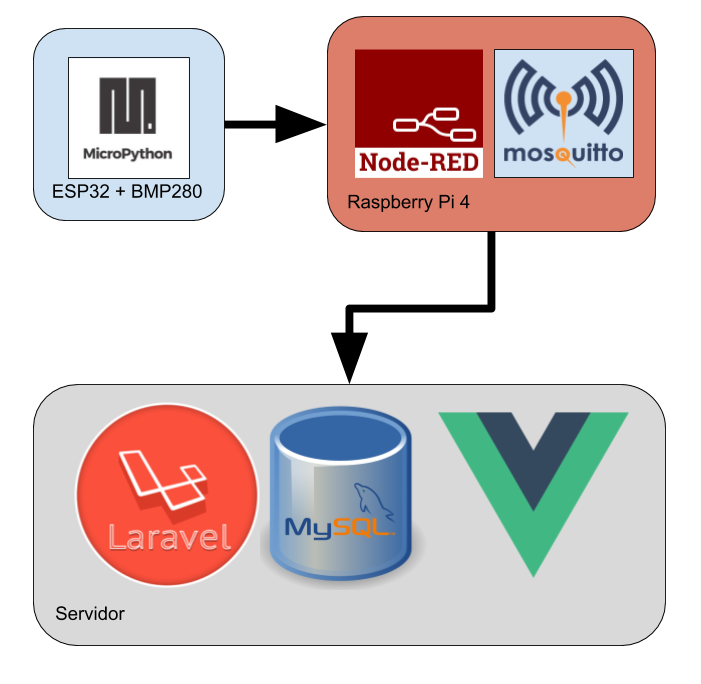

# Trabajo final

Alumno: Ciro Edgardo Romero
Docente: Gustavo Ramoscelli

## Introduccion

Este trabajo se realiza como proyecto integrador de la materia **Desarrollo de Aplicaciones para Internet de las Cosas (Desarrollo de Aplicacion III)**, en el contexto de la Carrera de Especializacion en Internet de las Cosas.

## Pre-requisitos

Es necesario tener instaladas las siguientes herramientas:
 - [Git](https://git-scm.com/book/en/v2/Getting-Started-Installing-Git)
 - [PHP 7](https://docs.npmjs.com/cli/install)
 - [Composer](https://getcomposer.org/)
 - [NPM](https://docs.npmjs.com/cli/install)
 - [ESPTools](https://github.com/espressif/esptool)
 - [MPFShell](https://github.com/wendlers/mpfshell)

Sistema operativo **Ubuntu 16**, o superior.

## Pasos para iniciar el programa

### Descargar el repositorio

Cloran el repositorio e ingresar en el carpeta
```
git clone https://github.com/ciror00/daiot_tp_final

cd daiot_tp_final
```

### Estructura del proyecto

El Sistema en su totalidad consta de tres componentes, llamados Orchestrator, Services y Devices.

Cada uno de estos elementos, se despliega en un entorno diferentes, logrando un proyecto diverso y multi tecnologico.



#### Orchestrator

Se trata de una Aplicacion Web donde se administran los dispositivos autorizado a publicar en el sistema y un panel de visualizacion de datos, donde se ven las mediciones en forma de graficos de lineas.

Para levartar el proyecto se tiene que entrar dentro de la carpeta correspondiente.

Primero se tiene que instalar las dependencias
```
~/Orchestrato$ composer install
~/Orchestrato$ npm install
```
Despues se tiene que migrar la estructura de la base de datos
```
~/Orchestrato$ php artisan migrate
```
Por ultimo, iniciamos el servidor, especificando el host

```
~/Orchestrato$ php artisan serve --host=0.0.0.0
```

Cuando el proyecto este iniciado, tendremos los siguiente modulos funcionando.

 - Dashboard: ["raiz"](http://localhost:8000/)
 - CRUD Devices: [/admin/device](http://localhost:8000/admin/device)


#### Service

Es un proyecto escrito en Node-RED, que recibe la informacion desde un Broker MQTT y la envia a un end point del *Orchestrator*.

#### Device

Es un Mote basado en ESP32 y escrito en Micropython. Para programar se tiene que conectar la placa a un puerto y darle permisos de escritura.
```
~/$ dmesg | grep tty
~/$ sudo chmod 666 /dev/ttyUSB0
```
Despues, con la herramienta ESPTools, se tien que formatear la placa.
```
~/$esptool --port /dev/ttyUSB0 erase_flash
```
Despues, tenemos que pararnos en la carpeta donde esta el firmwar e de Micropython y programar el interprete.
```
~/Device/bin$ esptool --chip esp32 --port /dev/ttyUSB0 write_flash -z 0x1000 esp32-firmware.bin
```

Por ultimo, tenemos que cargar el programa en la memoria del micro para que sea leido por el interprete. PAra eso, utilizamos el MPFSHell. Nos paramos en la carpeta donde se encuentra el codigo,
```
~/Device/$ 
mpfs [/]> put src/
mpfs [/]> close
```

## Licencia 📄

Este proyecto está bajo la Licencia GPL.

---